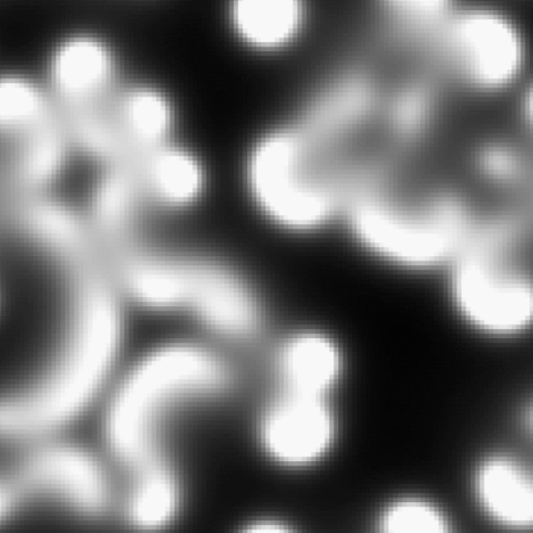

# Reaction-Diffusion Simulation

This project implements a Reaction-Diffusion simulation using the Gray-Scott model, available in both C++ and web versions. It visualizes various patterns that emerge from the interaction of two virtual chemicals in a 2D grid.

## Visual Demonstrations

<table>
  <tr>
    <td width="33%">
      
      <p align="center"><em>Mitosis (Animated)</em></p>
    </td>
    <td width="33%">
      
      <p align="center"><em>Mitosis (Static)</em></p>
    </td>
    <td width="33%">
      
      <p align="center"><em>Coral Growth (Animated)</em></p>
    </td>
  </tr>
  <tr>
    <td width="33%">
      
      <p align="center"><em>Coral Pattern (Static)</em></p>
    </td>
    <td width="33%">
      
      <p align="center"><em>Spiral Pattern 1</em></p>
    </td>
    <td width="33%">
      
      <p align="center"><em>Spiral Pattern 2</em></p>
    </td>
  </tr>
</table>

## Table of Contents

- [Introduction](#introduction)
- [Features](#features)
- [Versions](#versions)
  - [C++ Version](#c-version)
  - [Web Version](#web-version)
- [Mathematical Model](#mathematical-model)
- [Getting Started](#getting-started)
  - [Prerequisites](#prerequisites)
  - [Installation](#installation)
- [Usage](#usage)
  - [Running the Simulation](#running-the-simulation)
  - [Controls](#controls)
  - [Changing Patterns](#changing-patterns)
- [Project Structure](#project-structure)
- [Building and Running](#building-and-running)
- [Contributing](#contributing)
- [Possible Improvements](#possible-improvements)
- [FAQ](#faq)
- [References](#references)
- [License](#license)

## Introduction

[Reaction-Diffusion systems](#mathematical-model) are mathematical models that describe how the concentration of substances changes in space over time due to local chemical reactions and diffusion. These systems can produce a wide variety of patterns, including spots, stripes, and more complex structures, making them useful for modeling various biological and chemical phenomena.

## Features

- Real-time simulation of the Reaction-Diffusion process
- Multiple pre-defined patterns (see [Changing Patterns](#changing-patterns))
- Interactive controls (see [Controls](#controls))
- Cross-platform support (C++ and Web versions)
- Easy-to-use build system

## Versions

### C++ Version

The C++ version provides a high-performance simulation using the [Raylib](https://www.raylib.com/) graphics library. It offers:

- Fast, real-time rendering
- Platform-native window and controls
- Easy compilation and execution via batch file

[Jump to C++ installation instructions](#installation)

### Web Version

The web version allows for easy access and sharing of the simulation. Features include:

- Browser-based simulation (no installation required)
- Interactive UI for pattern selection and parameter adjustment
- Responsive design for various screen sizes

[Try the web version now](https://datavorous.github.io/Gray-Scott-Reaction-Diffusion-Model/)

## Mathematical Model

This simulation uses the [Gray-Scott model](#references), defined by the following partial differential equations:

```
∂A/∂t = D_A ∇²A - AB² + f(1-A)
∂B/∂t = D_B ∇²B + AB² - (k+f)B
```

Where:
- A and B are the concentrations of two chemicals
- D_A and D_B are the diffusion rates of A and B
- f is the feed rate
- k is the kill rate
- ∇² is the Laplace operator

## Getting Started

### Prerequisites

- For C version:
  - C compiler 
  - [Raylib](https://www.raylib.com/) graphics library
- For Web version:
  - Modern web browser with JavaScript enabled

### Installation

1. Clone the repository:
   ```
   git clone https://github.com/datavorous/Gray-Scott-Reaction-Diffusion-Model.git
   ```

2. For C++ version, install Raylib following the instructions on their [website](https://www.raylib.com/).

3. The web version requires no additional installation.

## Usage

### Running the Simulation

#### C Version
Navigate and run the `build.bat` file, after placing the `libraylib.a` file inside the `lib/` folder. This will compile and run the simulation.

#### Web Version
Open the `index.html` file in your web browser, or visit the [online demo](https://datavorous.github.io/Gray-Scott-Reaction-Diffusion-Model/).

### Controls

- Left-click: Add chemical B to the simulation
- Spacebar: Pause/unpause the simulation
- Enter key: Reset the grid

### Changing Patterns

To change patterns in the C++ version, modify the `f` and `k` values in the `main.cpp` file according to this table:

| Pattern        | f       | k       |
|----------------|---------|---------|
| Mitosis        | 0.0367  | 0.0649  |
| Coral Growth   | 0.0545  | 0.062   |
| Fingerprint    | 0.055   | 0.062   |
| ... (and so on) |         |         |

In the web version, use the dropdown menu to select different patterns.

## Project Structure

```
reaction-diffusion-simulation/
├── bin/
│   └── Makefile
├── include/
├── lib/
├── src/
│   └── main.cpp
├── build.bat
├── index.html
└── README.md
```

## Building and Running

1. Navigate to the `bin` folder
2. Double-click `build.bat` or run it from the command line
3. The script will compile the code and launch the simulation

## Contributing

We welcome contributions to the Reaction-Diffusion Simulation project! Here's how you can help:

### Quick Start

1. Fork the repo and create your branch from `main`.
2. Make your changes, adhering to the best practises.
3. Ensure your code passes all tests.
4. Submit a pull request.

### Reporting Issues

- Check existing issues before creating a new one.
- Provide detailed information: version, OS, steps to reproduce, expected vs. actual behavior.

### Coding Standards

- Use the accepted and standard procedure for a given language.
- Use 4 spaces for indentation.
- Write clear, well-commented code.

### Commit Messages

Follow the [Conventional Commits](https://www.conventionalcommits.org/) specification:

```
type(scope): brief description

Longer description if necessary

Closes #123
```

### Testing

- Write unit tests for new features or bug fixes.
- Ensure all tests pass before submitting a PR.

### Documentation

- Update README.md and comments for significant changes.

## Possible Improvements

1. Implement real-time parameter adjustment in C version
2. Add option to switch between different models
3. More liquids?
4. Optimize for larger grids using GPU acceleration
5. Implement more complex reaction-diffusion systems

## FAQ

Q: Why does the simulation slow down with larger grids?
A: The computational complexity increases with grid size. Consider lowering the resolution or using a more powerful machine.

## References

1. [Pearson, J. E. (1993). Complex Patterns in a Simple System. Science, 261(5118), 189-192.](https://science.sciencemag.org/content/261/5118/189)
2. [Turing, A. M. (1952). The Chemical Basis of Morphogenesis. Philosophical Transactions of the Royal Society B, 237(641), 37-72.](https://royalsocietypublishing.org/doi/10.1098/rstb.1952.0012)

## License

This project is licensed under the GNU General Public License v3.0 - see the [LICENSE](LICENSE) file for details.

---

**Note**: This project is for educational purposes only. It does not claim to accurately represent real-world chemical or biological processes.
